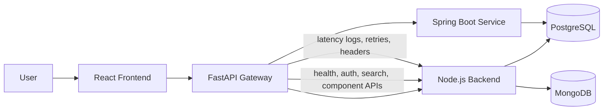
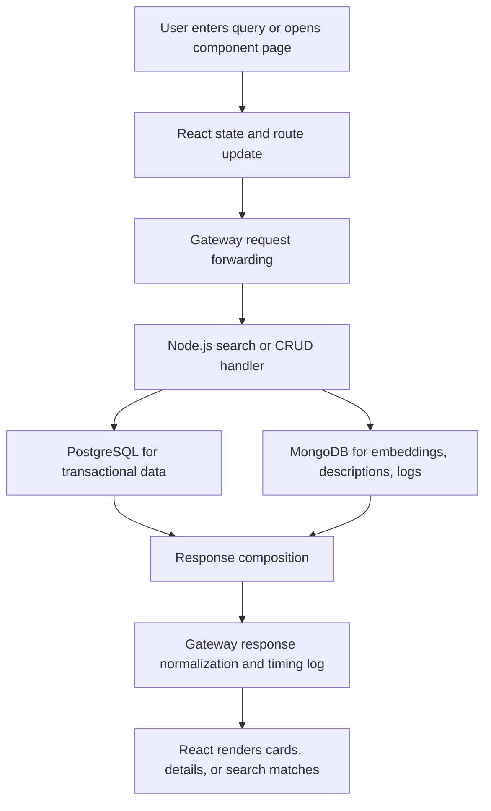
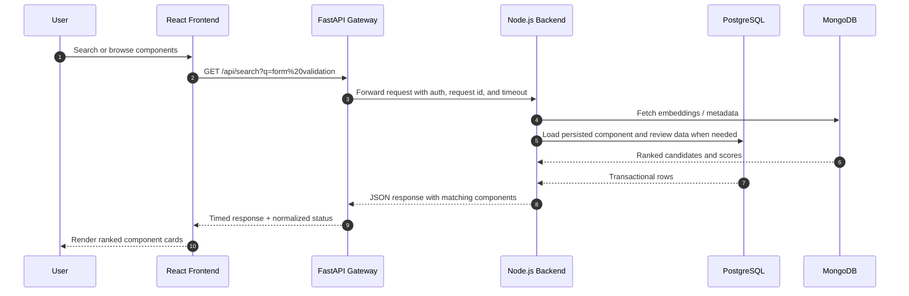

# Architecture

This project is a polyglot component showcase with a React client, a FastAPI gateway, a Node.js application backend, a Spring Boot service, PostgreSQL, and MongoDB. The diagrams below are written to be usable in an academic viva: they show structure, flow, and the reason each layer exists.

## 1. System Architecture



ASCII fallback:

```text
User -> React Frontend -> FastAPI Gateway -> Node.js Backend -> Spring Boot Service
                                           |-> PostgreSQL
                                           |-> MongoDB
```

## 2. Data Flow Diagram



## 3. Request Lifecycle



## 4. Microservice Interaction Map

| Service | Responsibility | Primary data |
|---|---|---|
| React frontend | Presentation, routing, evaluator demo flow | Browser state |
| FastAPI gateway | Single entry point, auth propagation, request timing, security headers | No durable data |
| Node.js backend | Component catalog, reviews, ratings, discussions, search orchestration | PostgreSQL + MongoDB |
| Spring Boot service | Enterprise-style comparison service and supporting domain logic | PostgreSQL |
| PostgreSQL | Source of truth for transactional entities and relationships | Structured relational data |
| MongoDB | Flexible descriptions, embeddings, logs, and semantic search payloads | Semi-structured and vector data |

## 5. Why This Layout Scores Well Academically

- It separates presentation, gateway, orchestration, and persistence concerns.
- It makes the gateway visible as an architectural control point instead of a hidden proxy.
- It uses PostgreSQL for invariants and MongoDB for flexible search artifacts, which is easier to defend in a viva.
- It supports measurable proof because every hop can be timed and explained.

## 6. Related Evidence

- [Database design proof](database-design.md)
- [Vector search proof](vector-search.md)
- [Security model](security.md)
- [Performance report](performance-report.md)