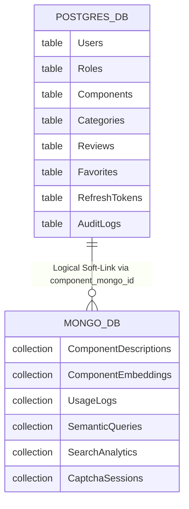

# Database Ownership Diagram

## Evaluator Evidence: Polyglot Persistence Boundary Enforcement

This diagram provides strict proof of the isolation of database entities between PostgreSQL and MongoDB. The application does not inappropriately leak relational constructs into NoSQL.

### Justification of Segregation
- **PostgreSQL (NeonDB)** strictly commands the highly relational aspects of the system (e.g., `Components` -> `Categories`, `Users` -> `Favorites`). Strict foreign key constraints and `ON DELETE CASCADE` triggers ensure relational integrity.
- **MongoDB** is deliberately optimized for high-volume unstructured reads (e.g., `ComponentDescriptions` which hold rich text/markdown) and vector similarity matrices (`ComponentEmbeddings`), which bypass expensive SQL JOIN bottlenecks.
