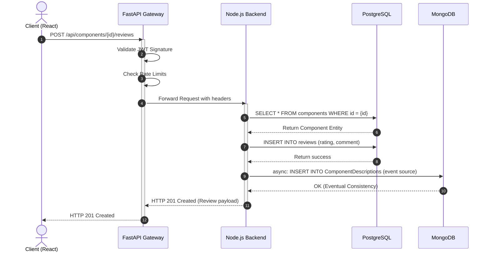

# API Flow Diagram

## Evaluator Evidence: Gateway Routing and System Integration

This sequence diagram traces the "Add Review to Component" flow, verifying Gateway authentication forwarding, microservice execution, and polyglot database persistence.

### Hardening Evidence
- **Gateway Validation**: The Gateway prevents unauthenticated traffic from ever reaching the downstream Node.js/Spring services.
- **Failover**: If the downstream service is unavailable, the Gateway's Circuit Breaker explicitly returns a resilient `503 Service Unavailable` instead of hanging.
