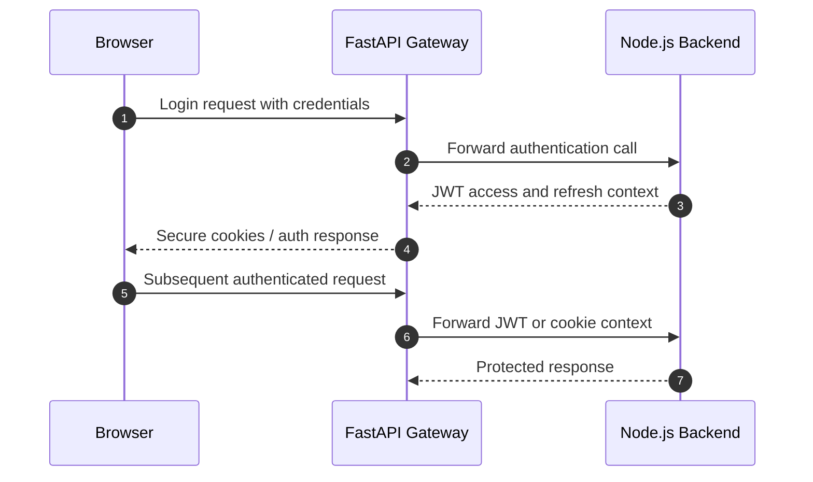

# Security

This project uses layered security controls instead of relying on a single protection mechanism.

## 1. JWT Authentication Flow

## 2. CSRF Protection

- CSRF tokens are issued for browser sessions.
- Unsafe requests must present the matching token.
- The backend middleware rejects mismatched tokens before business logic executes.
- This is especially important because the app uses cookies for browser-friendly auth flows.

Relevant implementation: [backend/src/middleware/csrf.js](../backend/src/middleware/csrf.js)

## 3. Rate Limiting

- Authentication routes are rate limited more aggressively than read-only routes.
- General API traffic has a broader window but is still capped.
- The gateway also reports request counts and error rates for oversight.

Relevant implementation:

- [backend/src/app.js](../backend/src/app.js)
- [gateway/controllers/healthController.py](../gateway/controllers/healthController.py)

## 4. Input Validation

Validation is applied before persistence or forwarding.

- required fields are checked early
- rating and text fields are constrained
- component categories are allowlisted
- avatar uploads are validated for type and size
- semantic search queries reject empty input

Relevant implementation:

- [backend/src/utils/validation.js](../backend/src/utils/validation.js)
- [backend/src/routes/mongoRoutes.js](../backend/src/routes/mongoRoutes.js)

## 5. Secure Headers

The ingress layer uses security headers to reduce common browser-side risks.

- `helmet` is enabled in the backend entrypoint
- cross-origin resource policy is tuned for frontend integration
- request IDs are propagated for traceability

Relevant implementation: [backend/src/app.js](../backend/src/app.js)

## 6. Cookie Handling

- auth flows use cookies for browser compatibility
- cookie settings are adapted for local and cross-site deployment modes
- secure and same-site behavior is determined by environment and origin context

Relevant implementation:

- [backend/src/middleware/auth.js](../backend/src/middleware/auth.js)
- [gateway/dependencies/security.py](../gateway/dependencies/security.py)

## 7. Security Summary For The Viva

The design combines:

- identity protection with JWT
- browser safety with CSRF defense
- abuse reduction with rate limiting
- data integrity with validation
- browser hardening with security headers
- traceability with request IDs and logs
