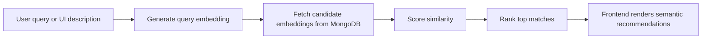

# Vector Search

This project already contains a working semantic retrieval path. The important academic point is not just that search exists, but that it is explainable, measurable, and visible in the UI.

## 1. What The Feature Does

Vector search maps component text into embeddings, compares a user query embedding against stored embeddings, and returns semantically related components.

The implementation uses:

- deterministic fallback embeddings when no external provider is configured
- cosine similarity by default, with dot-product and Euclidean alternatives available
- MongoDB for embedding storage and fast candidate scanning
- a frontend prompt that turns plain-language UI descriptions into ranked matches

## 2. API

Primary evaluator-facing route:

```http
GET /api/search?q=form validation&limit=5
```

The older POST contract still works for compatibility, but the GET form is easier to demonstrate live from the browser.

## 3. Implementation Flow



## 4. Similarity Logic

The backend exposes these similarity modes:

- cosine
- dot product
- Euclidean similarity as a fallback option

Cosine similarity is the strongest default for semantic matching because it rewards directional similarity and is scale-insensitive once embeddings are normalized.

## 5. Sample Queries

### Query 1

```http
GET /api/search?q=form validation&limit=5
```

Likely matches:

- Validated Input
- Neon Input
- Toast Notification

Why these match:

- they contain form and feedback vocabulary
- their metadata refers to validation, helper text, or user feedback patterns

### Query 2

```http
GET /api/search?q=data table filters empty state&limit=5
```

Likely matches:

- Data Table
- Pagination or dashboard-style components
- Feedback components if the prompt mentions states or errors

### Query 3

```http
GET /api/search?q=auth form with email validation&limit=5
```

Likely matches:

- Neon Input
- Validated Input
- Modal or toast components for success and error flow

## 6. Frontend Use

The homepage now includes a natural-language search panel that asks the evaluator to describe a UI and then shows ranked semantic matches.

Relevant files:

- [frontend/src/pages/Index.jsx](../frontend/src/pages/Index.jsx)
- [frontend/src/services/componentEngagementService.js](../frontend/src/services/componentEngagementService.js)
- [backend/src/routes/mongoRoutes.js](../backend/src/routes/mongoRoutes.js)

## 7. Proof And Verification

- Deterministic fallback verified in the test suite.
- Search payload contract verified in the integration test suite.
- The new GET compatibility route was added so the demo can be run directly from the browser.

## 8. Why This Is High Value For The Viva

- It shows an applied vector search use case, not just a library call.
- It connects semantic retrieval to a visible UI journey.
- It supports a discussion of embeddings, similarity metrics, candidate ranking, and retrieval quality.
