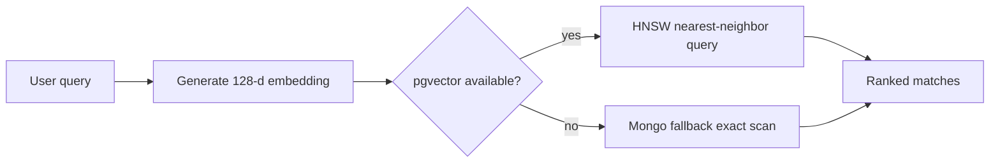

# Vector Search

This repository now has a real indexed vector-search path with a safe local fallback.

## Current Implementation

Primary indexed path:

- PostgreSQL `pgvector`
- `component_vector_embeddings`
- `embedding vector(128)`
- HNSW index using `vector_cosine_ops`
- cosine search by default
- dot-product and Euclidean alternatives in the service layer

Fallback path:

- MongoDB `ComponentEmbedding`
- deterministic or OpenAI-generated embeddings
- in-process similarity scoring
- used only when PostgreSQL is not configured, `pgvector` is unavailable, or the embedding dimensions do not match the pgvector table

Relevant files:

- `backend/src/services/pgVectorSearchService.js`
- `backend/src/routes/vectorRoutes.js`
- `backend/src/routes/mongoRoutes.js`
- `backend/src/services/embeddingProvider.js`
- `backend/src/sql/initSchema.js`
- `spring-service/src/main/resources/db/migration/V5__component_vector_embeddings.sql`

## API

Semantic search through the backend or gateway:

```http
POST /api/vector/search/semantic
Content-Type: application/json

{
  "query": "Form validation components",
  "limit": 5,
  "metric": "cosine"
}
```

Compatibility search route:

```http
GET /api/search?q=Reusable%20dashboard%20widgets&limit=5
```

## Retrieval Flow



The response includes retrieval metadata on the vector route:

```json
{
  "retrieval": {
    "engine": "pgvector-hnsw",
    "indexed": true,
    "dimensions": 128
  }
}
```

If the fallback path is used, the response reports `mongo-linear-fallback` and the reason.

## Evaluator Queries

Use these for live verification:

- `Form validation components`
- `Reusable dashboard widgets`

Expected behavior:

- form queries should rank input, validation, form, feedback, or toast-like components highly
- dashboard queries should rank data display, table, card, chart, or widget-like components highly

## Why This Meets CO2

- Embeddings are persisted.
- PostgreSQL provides an indexed vector store through `pgvector`.
- HNSW ANN is created when `pgvector` is available.
- MongoDB remains the document/search metadata store and fallback.
- The implementation is test-covered by `backend/src/tests/pgVectorSearch.test.js`.
